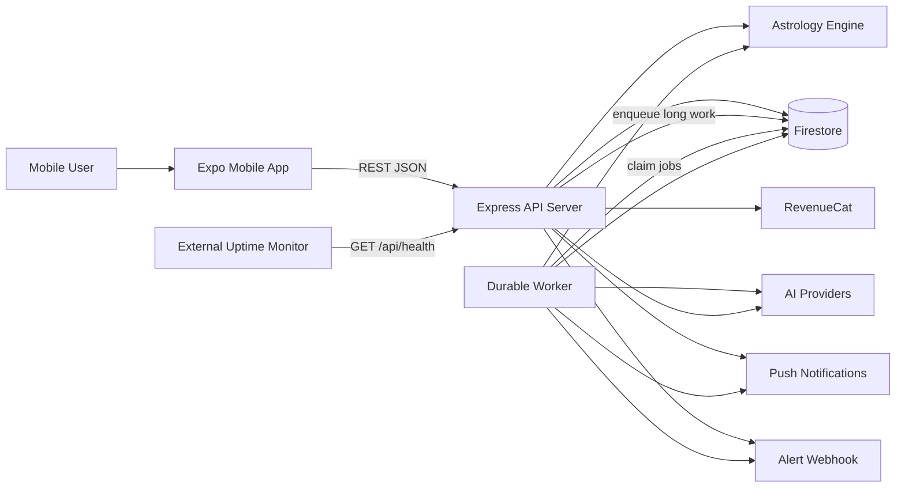
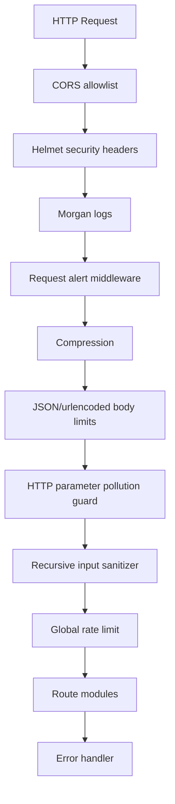
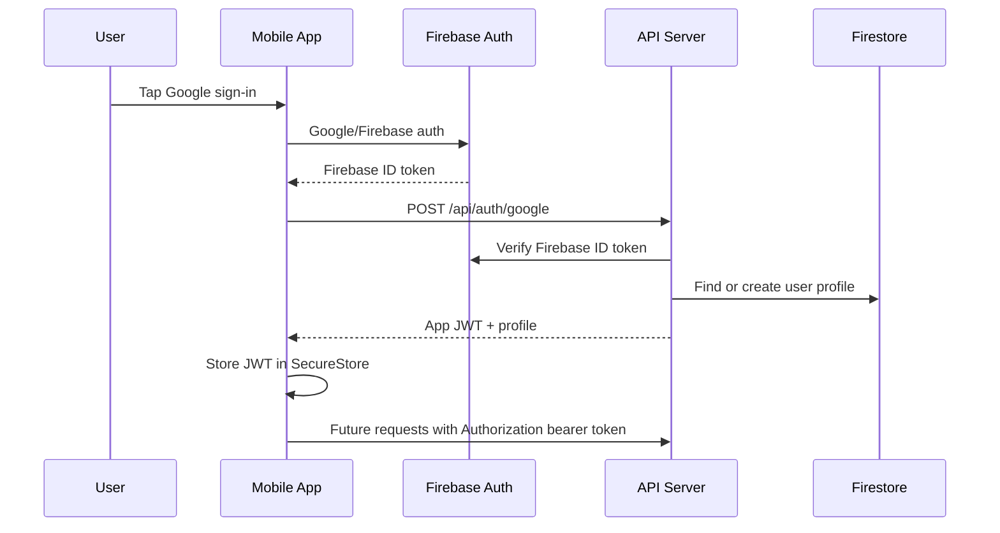
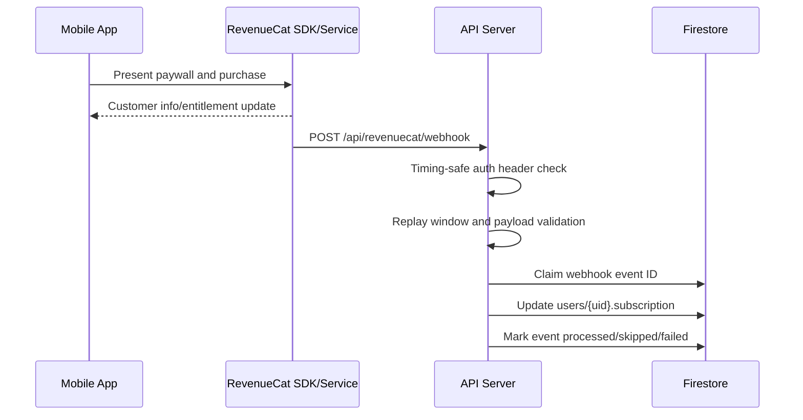
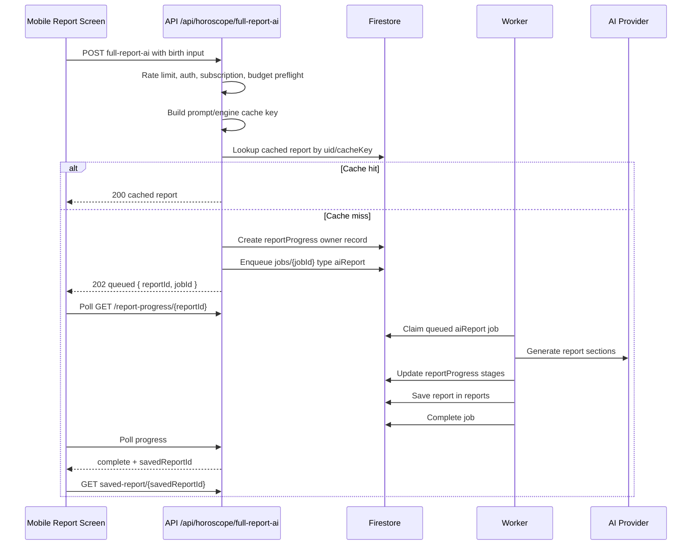

# Grahachara System Architecture Design

Last updated: 2026-05-08

## 1. Purpose

Grahachara is a Sri Lankan astrology product with a React Native/Expo mobile app, a Node.js/Express backend, a pure astrology calculation layer, AI-assisted interpretation features, RevenueCat subscription billing, Firestore persistence, and durable background workers for expensive long-running jobs.

This document explains how the full system works end to end: runtime components, request flows, authentication, subscriptions, AI cost controls, durable workers, Firestore collections, operational monitoring, backups, and local/production startup.

## 2. Architectural Goals

The current architecture is designed around these goals:

- Keep mobile clients thin and untrusted. The mobile app talks only to the REST API and does not directly read or write Firebase/Firestore application data.
- Keep astrology calculations deterministic and server-owned. Mobile requests chart, Nakath, Porondam, and prediction outputs from the server.
- Protect paid AI features with server-side subscription checks, one-time entitlement retry support, rate limits, and budget enforcement.
- Decouple long AI work from HTTP request lifetimes by queueing report and weekly Lagna jobs into durable Firestore-backed workers.
- Track real AI usage and cost so subscription economics can be monitored instead of guessed.
- Fail safely in production for billing/auth misconfiguration, while remaining usable in local development without Firebase credentials.

## 3. Repository Layout

```text
astro/
  mobile/                   Expo React Native application
    app/                    Expo Router screens and tab layout
    components/             Shared UI components
    constants/theme.js      Design tokens
    contexts/               Auth, language, pricing, theme state
    hooks/                  Responsive, device, network, keyboard helpers
    services/api.js         REST API client and auth token injection
    services/revenuecat.js  RevenueCat SDK integration
    services/firebase.js    Firebase client auth setup

  server/                   Node.js/Express API and worker runtime
    src/index.js            Express app entry point
    src/routes/             REST route modules
    src/middleware/         Auth, subscription, security, entitlements
    src/engine/             Astrology, AI prompts, report generation
    src/models/firestore.js Firestore data access layer
    src/services/           Queue, worker, cost, alerts, scheduler, storage
    scripts/worker.js       Durable worker process entry point
    scripts/firestore-*.js  Backup and restore scripts

  shared/                   Shared type definitions
  website/                  Static website and web assets
  docs/                     Operational and architecture documentation
  firestore.rules           Firestore client access rules
  firebase.json             Firebase rules/index configuration
```

## 4. Runtime Topology

The production system has three core runtime processes plus external services:

1. Mobile app: Expo/React Native app distributed to iOS, Android, and optionally web.
2. API server: Express REST API running `server/src/index.js` on port `3000` or the platform-provided `PORT`.
3. Worker process: Node worker running `server/scripts/worker.js`, processing Firestore `jobs`.
4. External services: Firebase Auth/Admin/Firestore, RevenueCat, AI providers, push notification services, alert webhooks, and uptime monitoring.



The mobile app never calls Firestore for application data. It authenticates through Firebase/Google and RevenueCat SDKs, but all business data, paid access checks, AI execution, and persistence go through the server.

## 5. Mobile Application Architecture

### 5.1 Main Responsibilities

The mobile app is responsible for:

- Rendering the user experience across onboarding, Today, Kendara/chart, AI report, Porondam, chat, and profile screens.
- Collecting birth details, city/location, language, and user preferences.
- Performing Google sign-in using Firebase client auth.
- Presenting RevenueCat paywalls and customer center.
- Calling the REST API via `mobile/services/api.js`.
- Polling report generation progress for queued AI reports.
- Storing auth tokens securely where supported.
- Keeping report cache metadata locally without storing full report bodies in AsyncStorage.

### 5.2 API Client Boundary

`mobile/services/api.js` centralizes all network calls. It chooses the API base URL automatically:

- `EXPO_PUBLIC_API_URL` when explicitly configured.
- `https://api.grahachara.com` in production builds.
- `http://<expo-host>:3000` during Expo Go development.
- `http://10.0.2.2:3000` for Android emulator fallback.
- `http://localhost:3000` as the final local fallback.

The API client also:

- Injects `Authorization: Bearer <token>` through `setAuthTokenGetter()`.
- Sends `X-App-Country` for pricing localization when available.
- Applies fetch timeouts.
- Retries transient `429`, `502`, `503`, and `504` responses with exponential backoff where enabled.
- Returns normalized errors with `statusCode`, `code`, `retryAfter`, entitlement metadata, and retry flags.

### 5.3 Auth Context

`mobile/contexts/AuthContext.js` owns login state:

1. User signs in with Google.
2. Firebase client produces an ID token.
3. Mobile posts the ID token to `POST /api/auth/google`.
4. Server verifies the token and returns an application JWT.
5. Mobile stores the JWT in `expo-secure-store` when available.
6. Mobile falls back to AsyncStorage only where SecureStore is unavailable, mainly web.
7. AuthContext wires the JWT into the API client with `setAuthTokenGetter()`.
8. RevenueCat is initialized and logged in with the Firebase UID.
9. Push registration is attempted after auth.

User profile data and onboarding flags still use AsyncStorage, but the bearer token is migrated into SecureStore on native platforms.

### 5.4 Mobile Report Storage

The report screen stores local metadata only:

- `serverReportId`
- birth date/time/location summary
- language
- section count
- saved timestamp
- flags indicating server ownership

Full report narrative content lives on the server in Firestore `reports`. This reduces the amount of sensitive generated report text stored on the device.

### 5.5 Mobile Screen Areas

The tab layout is under `mobile/app/(tabs)/`:

- `index.js`: Today dashboard, Nakath, Panchanga, Rahu Kalaya.
- `kendara.js`: Birth chart and Sri Lankan chart display.
- `report.js`: Full AI report request, progress, saved report display, PDF export.
- `porondam.js`: Marriage compatibility and shareable Vibe Check flows.
- `chat.js`: Paid AI astrologer chat.
- `profile.js`: Account, subscription, language, preferences.

Shared UI lives in `mobile/components/`, and design tokens come from `mobile/constants/theme.js`.

## 6. Server Application Architecture

### 6.1 Express Entry Point

`server/src/index.js` initializes the API:

1. Loads `.env`.
2. Applies production boot guards.
3. Initializes Firebase Admin and Firestore if credentials are available.
4. Adds security middleware in a fixed order.
5. Registers route modules.
6. Starts the HTTP listener.
7. Starts memory monitoring and notification scheduler.
8. Optionally starts an embedded worker only when `START_EMBEDDED_WORKER=true`.

Production boot fails if any of these unsafe conditions are present:

- `MOCK_PAYMENTS=true`.
- Missing or weak `JWT_SECRET`.
- Missing `REVENUECAT_WEBHOOK_AUTH_KEY`.
- Missing `GOOGLE_OAUTH_CLIENT_ID`.

### 6.2 Middleware Pipeline

Requests pass through the following server-wide pipeline:



Route-specific middleware then adds combinations of:

- IP rate limits such as `authLimiter`, `aiLimiter`, `reportLimiter`, and `chatLimiter`.
- `phoneAuth` for JWT/Firebase bearer token decoding.
- `requireSubscription` for paid features.
- `requireAdmin` for telemetry/admin endpoints.
- `distributedAiUserLimiter` and `distributedReportUserLimiter` for Firestore-backed cross-instance quotas.
- `budgetGuard(feature)` for global/user AI spend preflight checks.

### 6.3 Route Modules

The API is mounted under `/api`:

| Prefix | Module | Purpose |
|---|---|---|
| `/api/health` | inline | Health check for uptime monitoring. |
| `/api/auth` | `routes/auth.js` | Google login, JWT issuing, onboarding, subscription status. |
| `/api/revenuecat` | `routes/revenuecat.js` | RevenueCat webhook and server-side subscription status. |
| `/api/pricing` | `routes/pricing.js` | Public pricing plus admin cost/unit-economics telemetry. |
| `/api/nakath` | `routes/nakath.js` | Daily Nakath, Panchanga, Rahu Kalaya. |
| `/api/horoscope` | `routes/horoscope.js` | Daily horoscope, birth chart, AI report queueing, saved reports, analytics. |
| `/api/porondam` | `routes/porondam.js` | Compatibility check, paid AI report, Vibe Check links, history. |
| `/api/chat` | `routes/chat.js` | Paid AI astrologer chat and quota. |
| `/api/reading` | `routes/reading.js` | Paid full AI reading. |
| `/api/weekly-lagna` | `routes/weeklyLagna.js` | Weekly Lagna reads and admin generation queueing. |
| `/api/notifications` | `routes/notifications.js` | Push token registration, history, preferences, alert helpers. |
| `/api/user` | `routes/user.js` | Profile, birth data, preferences, user history. |
| `/api/entitlements` | `routes/entitlements.js` | Generation entitlement checks ("pay once, generate until success" retries). |
| `/api/predictions` | `routes/predictions.js` | Transit, timing, Muhurtha, health, annual, feedback helpers. |
| `/api/rectification` | `routes/rectification.js` | Birth-time rectification helpers. |
| `/api/share` | `routes/share.js` | Weekly cards and personality share outputs. |
| `/api/enhanced` | `routes/enhanced.js` | Advanced deterministic astrology helpers. |
| `/api/jyotish` | `routes/jyotish.js` | Jyotish library-backed calculations when available. |
| `/api/geocode` | `routes/geocode.js` | City/location search. |

## 7. Astrology Engine Architecture

The core astrology layer is in `server/src/engine/`.

### 7.1 Deterministic Calculation Layer

`server/src/engine/astrology.js` is the main Vedic calculation module. It provides:

- Panchanga.
- Daily Nakath.
- Planet positions.
- Lagna.
- Rashi chart.
- Navamsha chart.
- House charts.
- Full deterministic report data.

The project convention is sidereal astrology. Tropical longitudes must be converted through `toSidereal(...)` before Rashi or Nakshatra lookup. Lahiri Ayanamsha is used by the local engine.

Other deterministic modules include:

- `porondam.js`: 7-factor Porondam scoring out of 20.
- `advanced.js`: advanced chart analysis.
- `predictions.js`, `muhurtha.js`, `maraka.js`, and related modules for timing and transit features.

### 7.2 AI Interpretation Layer

AI lives above deterministic chart calculations. The server builds structured astrology payloads, prompt policy blocks, and language instructions, then asks Gemini/OpenAI-compatible providers to generate user-facing interpretation.

Important properties:

- The server owns prompt construction and model configuration.
- AI calls are wrapped with token usage extraction.
- Token output caps and thinking budgets are kept bounded.
- `trackCost(feature, uid, usage)` records actual usage after successful AI calls.
- Expensive AI features are guarded before execution with budget and subscription middleware.

AI features include:

- Chat astrology answers.
- Full AI narrative report sections.
- AI chart analysis.
- Sinhala/English chart translations and explanations.
- Porondam AI report.
- Weekly Lagna generation.
- Full reading endpoint.

## 8. Authentication And Subscription Architecture

### 8.1 Login Flow



The server can verify:

- App JWTs signed with `JWT_SECRET`.
- Firebase ID tokens as a fallback path.

`phoneAuth` attaches `req.user` when a bearer token is valid. Paid routes pair `phoneAuth` with `requireSubscription`; `phoneAuth` by itself is not a paid access gate.

### 8.2 Subscription Flow

RevenueCat handles in-app purchase billing. The mobile app presents RevenueCat paywalls and logs RevenueCat in with the Firebase UID. Server-side access decisions are based on Firestore subscription state.



Paid API routes require active Firestore subscription status unless `MOCK_PAYMENTS=true` in local development. Production boot blocks `MOCK_PAYMENTS=true`.

### 8.3 RevenueCat Webhook Hardening

The webhook route uses these controls:

- `Authorization: Bearer <REVENUECAT_WEBHOOK_AUTH_KEY>`.
- Timing-safe string comparison.
- Payload shape validation.
- Event timestamp replay window.
- Deterministic event ID construction.
- Firestore `revenuecatWebhookEvents` de-duplication.
- Explicit processed, skipped, duplicate, and failed states.
- Critical alert on webhook processing failure.

## 9. Paid Feature Gates

Important paid/admin route classifications:

| Feature | Route | Main Guards |
|---|---|---|
| Chat | `POST /api/chat/ask` | `phoneAuth`, `requireSubscription`, user AI limit, distributed limit, `budgetGuard('chat')`. |
| Full AI report | `POST /api/horoscope/full-report-ai` | report IP limit, `phoneAuth`, `requireSubscription`, per-user report limit, distributed report limit, `budgetGuard('fullReport')`. |
| AI analysis | `POST /api/horoscope/ai-analysis` | `phoneAuth`, `requireSubscription`, AI user limit. |
| Porondam AI report | `POST /api/porondam/report` | AI IP limit, `phoneAuth`, `requireSubscription`, user AI limit, distributed AI limit, `budgetGuard('porondamReport')`. |
| Full reading | `POST /api/reading/full` | `phoneAuth`, `requireSubscription`, report user limits, distributed report limit, `budgetGuard('reading')`. |
| Weekly Lagna generation | `POST /api/weekly-lagna/generate` | `requireAdmin`, `budgetGuard('weeklyLagna')`, queues job. |
| Live cost stats | `GET /api/pricing/live-stats` | `requireAdmin`. |
| Persist cost stats | `POST /api/pricing/persist-stats` | `requireAdmin`. |
| Unit economics | `GET /api/pricing/unit-economics` | `requireAdmin`. |
| Prompt analytics | `GET /api/horoscope/prompt-analytics` | `requireAdmin`. |

Route classification tests live in `server/src/routes/__tests__/routeClassification.test.js`.

## 10. Full AI Report Architecture

Full AI report generation is the most expensive user-facing workflow. It is designed as an asynchronous durable job.

### 10.1 Report Request Flow



### 10.2 Cache Key Design

AI report caching is versioned and input-normalized. `buildReportCacheKey()` includes:

- birth date/time
- rounded latitude/longitude
- language
- birth location
- user profile attributes used in the prompt
- marital status/year when present
- calculation settings
- `asOfDate`
- prompt version
- engine version
- cache version

The final cache key shape is:

```text
ai-report:<cacheVersion>:<promptVersion>:<engineVersion>:<inputHash>
```

This prevents stale prompt or engine outputs from being reused after meaningful changes.

### 10.3 Report Progress Model

Progress is stored in two places:

- In-memory Map for fast local access during active generation.
- Firestore `reportProgress` for durable cross-process and post-restart polling.

The durable record contains:

- `reportId`
- `ownerUid`
- `jobId`
- `stage`
- `sectionsDone`
- `sectionsTotal`
- `currentSection`
- `completedSections`
- `savedReportId`
- `error`
- timestamps and TTL expiration

The progress endpoint requires auth and checks that the polling user owns the progress record.

### 10.4 Report Job Completion

The worker:

1. Claims an `aiReport` job.
2. Creates or updates report progress.
3. Runs deterministic chart generation and AI section generation.
4. Tracks AI cost as `fullReport`.
5. Saves the report to Firestore `reports` with cache metadata.
6. Marks progress complete with `savedReportId`.
7. Fulfills any generation entitlement.
8. Marks the job complete.

If the AI provider returns a temporary error, the job is requeued until max attempts. Permanent failures mark progress failed and alert `report_generation_failed`.

## 11. Durable Worker Architecture

Long report and weekly Lagna work is processed by `server/scripts/worker.js`.

### 11.1 Job Queue Data Model

Jobs are stored in Firestore `jobs` with fields such as:

- `id`
- `type`: currently `aiReport` or `weeklyLagna`
- `uid`
- `status`: `queued`, `running`, `complete`, or `failed`
- `payload`
- `uniqueKey` for de-duplication
- `progressId`
- `attempts`
- `maxAttempts`
- `runAfter`
- `lockedBy`
- `lockUntil`
- `result`
- `error`
- `expiresAt`

`enqueueJob()` uses a deterministic job ID when a `uniqueKey` is provided. Existing queued/running/retrying jobs with the same ID are returned as deduped instead of duplicated.

### 11.2 Claiming And Locking

Workers call `claimNextJob(workerId, types)`:

1. Query a small batch of `queued` jobs.
2. Filter by type in process.
3. Skip jobs whose `runAfter` is in the future.
4. Use a Firestore transaction to atomically change status to `running`.
5. Set `lockedBy`, `lockUntil`, increment `attempts`, and update timestamps.

This lets multiple workers run at the same time without intentionally processing the same job.

### 11.3 Worker Modes

Run continuously:

```bash
cd server
npm run worker
```

Run one job and exit:

```bash
cd server
npm run worker:once
```

Limit job types:

```bash
node scripts/worker.js --types=aiReport
node scripts/worker.js --types=weeklyLagna --once
```

API and worker should be separate production processes. `START_EMBEDDED_WORKER=true` is for local smoke testing only.

## 12. Weekly Lagna And Scheduler Architecture

The API starts a notification scheduler when Firebase is available. The scheduler handles:

- Rahu Kalaya warning notifications.
- Daily guidance notifications.
- Maraka Apala checks.
- Weekly Lagna generation scheduling.

Weekly Lagna generation is no longer executed inline by the scheduler or admin route. Both paths enqueue a `weeklyLagna` job. The worker generates weekly reports, tracks `weeklyLagna` AI cost, stores results, and sends weekly push notifications.

For production reliability, the worker should run as a service, Cloud Run service/job, VM process, Kubernetes deployment, or scheduler-invoked one-shot worker.

## 13. Porondam And Vibe Link Architecture

### 13.1 Porondam Compatibility

`POST /api/porondam/check` performs deterministic compatibility scoring. It can run with optional auth and saves history when a user is authenticated.

`POST /api/porondam/report` is the paid AI interpretation layer. It requires subscription and budget/rate guards before invoking AI.

### 13.2 Vibe Links

Vibe links are shareable compatibility invites. They are stored in Firestore `vibeLinks` with:

- `linkId`
- optional `ownerUid`
- sender name and birth data
- receiver name after use
- `used` and `usedAt`
- `expiresAt`

The server also has in-memory fallback behavior for local development without Firestore. Production should rely on Firestore and configure TTL for expiration.

## 14. Data Storage Architecture

Firestore is the main durable store. Firebase Admin SDK is used by the server, so server writes bypass Firestore client rules. Client rules still matter as defense in depth if direct client access is introduced later.

### 14.1 Firestore Collections

| Collection | Purpose | Typical Owner |
|---|---|---|
| `users` | Profiles, birth data, preferences, subscription state, usage counts. | User document ID is Firebase UID. |
| `reports` | Saved AI reports and report cache metadata. | `uid` field. |
| `reportFeedback` | User feedback on generated report claims/sections. | `uid` field. |
| `promptAnalytics` | Prompt validation and unsupported-term analytics. | Server/admin. |
| `charts` | Cached chart, translation, explanation data. | `uid` field. |
| `chatSessions` | Saved chat sessions and message history. | `uid` field. |
| `porondamResults` | Saved compatibility results and AI report text. | `uid` field. |
| `notifications` | Push notification history and preference-derived records. | `uid` field. |
| `jobs` | Durable queued/running/completed/failed worker jobs. | Server only. |
| `reportProgress` | Durable report generation progress with owner UID and TTL. | `ownerUid` field. |
| `vibeLinks` | Shareable compatibility invite records with TTL. | Optional `ownerUid`. |
| `rateLimits` | Distributed fixed-window counters. | Server only. |
| `dailyAiSpend` | Global daily AI spend counters. | Server only. |
| `dailyAiUserSpend` | Per-user daily AI spend counters. | Server only. |
| `aiCostEvents` | Per-call AI cost audit events. | Server only. |
| `revenuecatWebhookEvents` | Webhook replay/de-duplication audit records. | Server only. |
| `entitlements` | Retryable generation entitlements. | `uid` field, server-created. |

### 14.2 Firestore Rules

`firestore.rules` follows a default-deny model:

- Users can read their own `users/{uid}` document.
- Users can read documents where `resource.data.uid == request.auth.uid` for reports, charts, chats, Porondam, and feedback.
- Users can read their own `reportProgress` where `ownerUid` matches.
- Weekly Lagna reports are public read.
- All writes are denied to clients.
- Operational collections such as `jobs`, rate limits, budgets, AI cost events, and webhook events deny all client read/write.

Rules are covered by static tests in `server/src/security/__tests__/firestoreRules.test.js`.

### 14.3 TTL Fields

The following collections write `expiresAt` fields and should have Firestore TTL policies configured:

- `jobs`
- `reportProgress`
- `vibeLinks`
- `rateLimits`
- `dailyAiSpend`
- `dailyAiUserSpend`
- `aiCostEvents`
- `revenuecatWebhookEvents`
- `entitlements`

## 15. AI Cost, Budget, And Rate Limit Architecture

### 15.1 Cost Tracking

`server/src/services/costTracker.js` maintains live in-memory daily cost stats and writes distributed cost audit records through `recordAICostEvent()`.

Tracked feature buckets include:

- `fullReport`
- `porondam`
- `chat`
- `weeklyLagna`
- `reading`
- `aiAnalysis`
- `chartTranslation`
- `chartExplanation`

The tracker normalizes token usage into cost USD/LKR, input/output/thinking token counts, generation time, and feature-level contribution metrics.

### 15.2 Budget Enforcement

`budgetGuard(feature)` performs preflight checks against Firestore counters before expensive AI work starts.

Supported budget controls:

- `DAILY_GLOBAL_AI_SPEND_LIMIT_LKR`
- `DAILY_USER_AI_SPEND_LIMIT_LKR`
- per-feature estimate overrides using `AI_BUDGET_ESTIMATE_<FEATURE>_LKR`

If Firestore is unavailable, budget enforcement fails open. In production, Firebase should be configured so this control is active.

### 15.3 Distributed Rate Limiting

The API uses both process-local Express rate limits and Firestore-backed distributed rate limits.

Distributed limiters:

- `distributedAiUserLimiter`: default `DISTRIBUTED_AI_USER_PER_MINUTE=8`.
- `distributedReportUserLimiter`: default `DISTRIBUTED_REPORT_USER_PER_HOUR=2`.

Counters are fixed-window buckets in `rateLimits`, keyed by hashed user ID or IP. If Firestore errors, the limiter logs and fails open to preserve availability.

## 16. Entitlement Retry Architecture

Generation entitlements prevent users from paying again when a paid generation fails after payment.

The flow is:

1. Server creates or resumes an entitlement for a user, feature type, and input hash.
2. Generation starts.
3. On success, the entitlement is fulfilled.
4. On failure, the entitlement remains pending with error metadata.
5. The user can retry the same input with the same entitlement.
6. Retry count, pending count, and TTL constrain abuse.

Entitlements are server-created, input-hash-bound, transactionally updated, and expire after 7 days by default.

## 17. Observability And Alerting

The server can send JSON alerts to `ALERT_WEBHOOK_URL`.

In-code alert events:

- `http_5xx`
- `http_latency_high`
- `memory_rss_high`
- `report_generation_failed`
- `revenuecat_webhook_failed`
- `ai_spend_threshold`

Recommended external monitoring:

```text
GET https://api.grahachara.com/api/health
```

Suggested platform alerts:

- 5xx rate over 2 percent for 5 minutes.
- p95 latency over 10 seconds for 5 minutes.
- p99 latency over 45 seconds for 5 minutes.
- Container memory over 85 percent for 5 minutes.
- Worker queue age over 5 minutes for normal traffic.
- RevenueCat webhook failures.
- Backup failures.

More detail lives in `docs/production-monitoring-alerts.md`.

## 18. Backup And Restore Architecture

Firestore backups are handled by scripts in `server/scripts/`:

- `npm run firestore:backup`
- `npm run firestore:restore`

Backups export Firestore to a Google Cloud Storage bucket. Restore requires explicit `CONFIRM_FIRESTORE_RESTORE=YES` and should be tested against staging before production.

Recommended operating model:

- Daily automated export near midnight Sri Lanka time.
- At least 30 days of daily backup retention.
- Monthly backup retention for 12 months.
- Restore drills in staging.
- Backup failure alerts.

More detail lives in `docs/firestore-backup-restore-runbook.md`.

## 19. Deployment And Startup

### 19.1 Local Development

Install dependencies:

```bash
cd server
npm install

cd ../mobile
npm install
```

Start the API:

```bash
cd server
npm run dev
```

Start the mobile app:

```bash
cd mobile
npx expo start
```

Start the worker in a separate terminal when testing queued reports or weekly Lagna:

```bash
cd server
npm run worker
```

For one queued job:

```bash
cd server
npm run worker:once
```

Local Firebase is optional. Without credentials, the API starts in reduced dev mode and skips Firestore-dependent behavior where possible.

### 19.2 Production Runtime

Production should run at least two independent process types:

1. API service:

```bash
cd server
npm start
```

2. Worker service:

```bash
cd server
npm run worker
```

Optional supporting jobs:

- Scheduled Firestore backup.
- Periodic one-shot worker if using managed tasks instead of a long-running worker.
- External uptime monitor.

Do not rely on `START_EMBEDDED_WORKER=true` for production scale. Use a separate worker deployment so API request handling and long AI execution can scale independently.

## 20. Environment Configuration

Key server environment variables:

| Variable | Purpose |
|---|---|
| `NODE_ENV` | Enables production boot guards when `production`. |
| `PORT` | API server port, defaults to `3000`. |
| `JWT_SECRET` | Signs app JWTs. Must be strong in production. |
| `GOOGLE_OAUTH_CLIENT_ID` | Google token verification. |
| `FIREBASE_SERVICE_ACCOUNT` | Firebase Admin credentials as JSON. |
| `GEMINI_API_KEY` | Gemini AI access. |
| `AI_PROVIDER` | AI provider selection where supported. |
| `REVENUECAT_WEBHOOK_AUTH_KEY` | RevenueCat webhook bearer secret. |
| `MOCK_PAYMENTS` | Local dev subscription bypass. Forbidden in production. |
| `START_EMBEDDED_WORKER` | Local-only API-embedded worker toggle. |
| `WORKER_POLL_MS` | Worker poll interval. |
| `JOB_TTL_MS` | Job expiration TTL. |
| `JOB_LOCK_MS` | Worker lock duration. |
| `REPORT_PROGRESS_TTL_MS` | Progress record expiration. |
| `VIBE_LINK_TTL_MS` | Vibe link expiration. |
| `DISTRIBUTED_AI_USER_PER_MINUTE` | Cross-instance AI user quota. |
| `DISTRIBUTED_REPORT_USER_PER_HOUR` | Cross-instance report quota. |
| `DAILY_GLOBAL_AI_SPEND_LIMIT_LKR` | Global daily AI spend ceiling. |
| `DAILY_USER_AI_SPEND_LIMIT_LKR` | Per-user daily AI spend ceiling. |
| `ALERT_WEBHOOK_URL` | Operational alert destination. |
| `ALERT_LATENCY_MS` | Slow request alert threshold. |
| `ALERT_MEMORY_RSS_MB` | Memory alert threshold. |
| `ALERT_DAILY_AI_SPEND_LKR` | Daily spend alert threshold. |
| `GOOGLE_CLOUD_PROJECT` | Firestore backup/restore project. |
| `FIRESTORE_BACKUP_BUCKET` | Backup export bucket. |

Mobile environment variables:

| Variable | Purpose |
|---|---|
| `EXPO_PUBLIC_API_URL` | API base URL override. |
| `EXPO_PUBLIC_FIREBASE_*` | Firebase client configuration. |
| `EXPO_PUBLIC_MOCK_PAYMENTS` | Mobile-side local RevenueCat bypass. |

When adding a new environment variable, update the real local `.env` and the appropriate `.env.example` file.

## 21. Security Model

Security controls are layered:

### 21.1 Client Boundary

- Mobile calls only REST API for application data.
- No direct mobile Firestore access is used for normal app behavior.
- JWT stored in SecureStore on native platforms.
- Report bodies are server-owned, with local metadata-only cache.

### 21.2 API Boundary

- CORS allowlist.
- Helmet headers.
- Request body size limits.
- HPP protection.
- XSS-oriented recursive input sanitization.
- Global and route-specific rate limits.
- JWT/Firebase token verification.
- Subscription and admin middleware.
- Firestore-backed distributed quotas and budgets.

### 21.3 Billing Boundary

- RevenueCat handles platform billing.
- Server accepts subscription state through authenticated webhooks.
- Webhooks are replay-limited and de-duplicated.
- Paid feature gates are tested statically.

### 21.4 Data Boundary

- Server writes all Firestore data through Admin SDK.
- Firestore client rules are default-deny for writes.
- Operational collections deny client read and write.
- User-owned reads require matching UID.

## 22. Testing And Validation

Main server test command:

```bash
cd server
npm test
```

Important test areas:

- Route classification tests for paid/admin endpoints.
- Firestore rules static tests.
- Existing server unit/integration tests.
- Worker smoke loading.
- Engine benchmark scripts.
- Prompt validation scripts.

Useful smoke checks:

```bash
cd server
node -e "require('./src/services/jobWorker'); require('./src/services/jobQueue'); require('./src/services/unitEconomics'); console.log('worker modules ok')"
```

```bash
curl http://localhost:3000/api/health
```

## 23. Operational Runbooks

Detailed runbooks:

- `docs/durable-workers-and-limits-runbook.md`
- `docs/firestore-backup-restore-runbook.md`
- `docs/production-monitoring-alerts.md`
- `docs/subscription-unit-economics.md`
- `docs/dependency-audit-triage-2026-05-08.md`

## 24. Common End-To-End Flows

### 24.1 Daily Nakath

1. Mobile opens Today tab.
2. Mobile calls `GET /api/nakath/daily`.
3. Server calculates daily Nakath, Panchanga, Rahu Kalaya from the engine.
4. Server returns deterministic JSON.
5. Mobile renders dashboard.

This flow does not require AI or subscription.

### 24.2 Birth Chart

1. Mobile sends birth date/time and coordinates.
2. Server validates input.
3. Server computes chart data through `engine/astrology.js`.
4. If authenticated, server can use chart cache helpers.
5. Mobile renders Sri Lankan chart and supporting analysis.

### 24.3 AI Chat

1. Mobile sends chat message to `POST /api/chat/ask`.
2. API applies auth, subscription, user AI limit, distributed limit, and budget guard.
3. Server builds prompt with language and optional birth context.
4. AI provider returns answer and token usage.
5. Server records chat cost and session metadata.
6. Mobile renders the answer.

### 24.4 Porondam

1. Mobile sends bride/groom data to `/api/porondam/check`.
2. Server computes deterministic compatibility result.
3. Authenticated users may get saved history.
4. If user requests AI report, `/api/porondam/report` requires subscription and budget/rate guards.
5. Server generates interpretation, tracks cost, and updates saved Porondam record when applicable.

### 24.5 RevenueCat Subscription Update

1. User purchases through mobile RevenueCat paywall.
2. RevenueCat sends webhook to server.
3. Server verifies webhook secret and validates payload timestamp.
4. Server claims event ID in Firestore.
5. Server updates `users/{uid}.subscription`.
6. Paid API calls now pass `requireSubscription`.

### 24.6 Full AI Report

1. Mobile posts report input.
2. API checks cache.
3. Cache hit returns report immediately.
4. Cache miss creates progress and queues job.
5. Worker generates and saves report.
6. Mobile polls progress and fetches saved report after completion.

## 25. Known Architectural Tradeoffs

- Firestore-backed rate limits and budgets are simpler than Redis to operate in this Firebase-centered system, but they fail open on Firestore errors and are not as low-latency as Redis.
- The API still starts an in-process notification scheduler. For higher production rigor, scheduled notification work can be moved to managed tasks just like weekly Lagna generation.
- Local development supports no-Firebase mode, which is convenient but means some production controls are inactive locally.
- Firestore rules are defensive because the mobile app does not currently use direct Firestore access for app data.
- The astrology engine is large and centralized. This keeps calculation behavior discoverable but makes careful testing important when changing core logic.

## 26. Production Readiness Checklist

Before enabling production paid AI traffic:

- API service is deployed with `NODE_ENV=production`.
- Worker service is deployed separately and processing `jobs`.
- Firebase Admin credentials are configured.
- Firestore rules and indexes are deployed.
- TTL policies are configured for expiring collections.
- RevenueCat webhook secret is configured in both RevenueCat and server env.
- `MOCK_PAYMENTS` and `EXPO_PUBLIC_MOCK_PAYMENTS` are disabled.
- `JWT_SECRET` is strong and stored in a secret manager.
- AI provider keys and model settings are configured.
- Budget limits and distributed quotas are set.
- Alert webhook and external uptime monitor are active.
- Firestore backup automation is scheduled and restore drill has passed.
- Server tests and route classification tests pass.
- Subscription unit economics endpoint shows acceptable contribution margin.

## 27. Mental Model

The simplest way to understand the system is:

```text
Mobile is presentation and device integration.
API is trust, billing, validation, orchestration, and synchronous calculations.
Engine is deterministic astrology plus AI prompt construction.
Firestore is durable state, queue, cache, and audit trail.
Worker is long-running AI execution.
RevenueCat is billing truth input.
Cost/rate/budget services keep paid AI economically bounded.
```

That separation is the main architectural invariant. New features should preserve it: mobile should call the API; the API should guard and orchestrate; deterministic astrology should stay in engine modules; long expensive work should move through durable jobs; server-owned data should remain in Firestore behind auth and ownership checks.